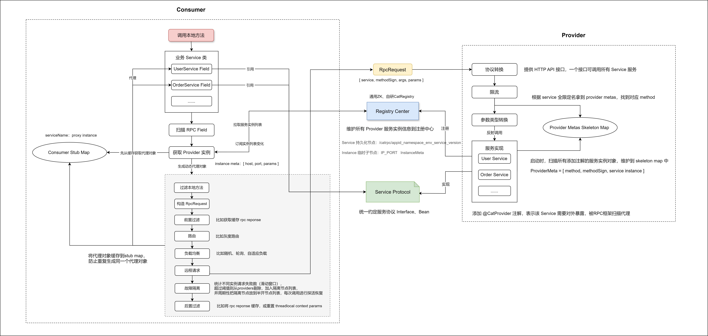

# 从零开始打造一个 RPC 框架 - CatRPC

---

## 一、背景
我们在学习业界优秀的开源框架过程中，往往会发现，这些框架的源码设计庞大而精妙，想要深入其中学习各种设计细节，需要花费大量的时间精力，且效率极低。

但其实这些项目初期，其核心功能都是非常简洁单一的，然后经过几年时间的不断发展迭代，支持越来越多复杂的场景功能，兼容不同的运行环境，处理无数的 issue case 后，复杂度才逐渐提高到如今这番让人望而却步。

作为框架使用者和学习者，我们不妨基于其最核心的功能，返璞归真，从零开始一步一步添砖加瓦，亲自动手打造这样一个框架。

在这个过程中，我们也许才能真正理解框架设计的来龙去脉，打开上帝视角。

---

## 二、架构设计

